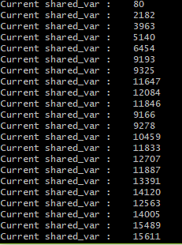

# 实验 1: 进程和线程的创建

## 1.1 实验目的

理解进程与线程的创建。

## 1.2 实验要求

<1> 在 Linux 下编写一个应用程序，命名为 `an_ch2_1b`。这个程序不断地输出如下行：

```shell
Those output come from child,[系统时间]
```

另外写一个应用程序，命名为 `an_ch2_1a`。这个程序创建一个子进程，执行 `an_ch2_1b`。这个程序不断地输出如下行：

```shell
Those output come from child,[系统时间]
```

观察程序运行的结果，并对你看到的现象进行解释。

<2> 在 Linux 环境下编写一个控制台应用程序，程序中有一个共享的整型变量 `shared_var`，初始值为 0；创建一个线程并使其立即与主线程并发执行。

新创建的线程与主线程均不断地循环，并输出 `shared_var` 的值。主线程在循环中不断地对 `shared_var` 进行加 1 操作，即每次循环 `shared_var` 被加 1；而新创建的线程则不断地对 `shared_var` 进行减 1 操作，即每次循环 `shared_var` 被减 1。观察程序运行的结果，并对你看到的现象进行解释。

## 1.3 实验步骤

### 子实验 1: 进程的创建

<1> 代码中需要包含头文件 `time.h`，输出并格式化当前系统时间。

```c
char* getCurrentTime(void)
{
    time_t timer;
    struct tm *tblock;
    timer = time(NULL);
    tblock = localtime(&timer);
    return asctime(tblock);
}
```

<2> 通过 `fork()` 创建进程，父进程中返回子进程的 `pid`，子进程中返回 0，创建不成功返回 -1，并且通过 `waitpid()` 让父进程等待子进程结束。

<3> 在命令行中编译执行 `bash exp_1.sh`，会自动编译链接生成 `an_ch2_1a` 、`an_ch2_1b` 和 `new_thread` 三个可执行文件。


`an_ch2_1b` 的输出结果如下：


`an_ch2_1b` 没有创建子进程，只是每隔 1 秒输出一次当前系统时间。

`an_ch2_1a` 的输出结果如下：


`an_ch2_1a` 创建了子进程，子进程每隔 1 秒输出一次当前系统时间，而父进程会等待子进程结束。

### 子实验 2: 线程的创建

<1> 代码中需要包含头文件 `pthread.h`，创建线程的函数为 `pthread_create()`。

<2> 对于共享变量 `shared_var`，需要使用 `pthread_mutex_t` 进行加锁。

```c
{
    pthread_mutex_lock(&mtx);
    ++shared_var;
    pthread_mutex_unlock(&mtx);
}
```

<3> 在命令行中编译执行 `bash exp_1.sh`，会自动编译链接生成 `an_ch2_1a` 、`an_ch2_1b` 和 `new_thread` 三个可执行文件。

<4> 执行 `new_thread`，会创建一个线程与主线程并发执行，执行结果如下：



可以发现 `shared_var` 的值在主线程和子线程中交替增减，说明线程的创建成功。

## 1.4 总结与感想

<1> 进程的创建与回收需要使用 `fork()` 和 `waitpid()`，其中父进程通过 `fork()` 创建子进程，子进程通过 `waitpid()` 等待父进程结束。如果子进程不调用 `waitpid()`，则子进程会成为僵尸进程，被 `init` 进程接管。

<2> 线程的创建与回收需要使用 `pthread_create()` 和 `pthread_join()`，其中主线程通过 `pthread_create()` 创建子线程，主线程通过 `pthread_join()` 等待子线程结束。如果主线程不调用 `pthread_join()`，则主线程结束后子线程也会被强制结束。
