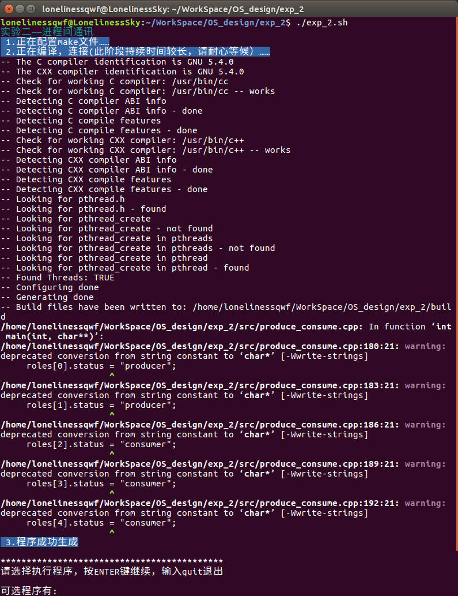
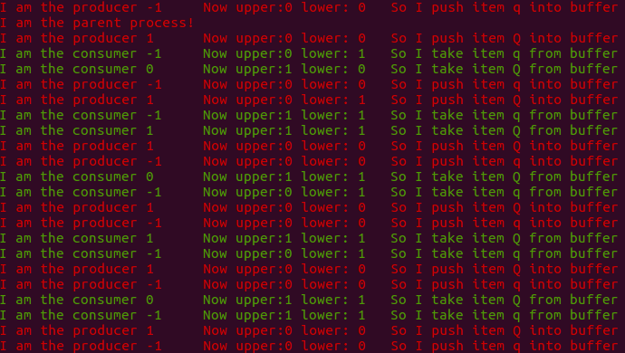
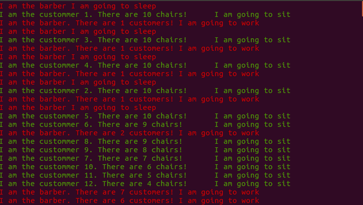
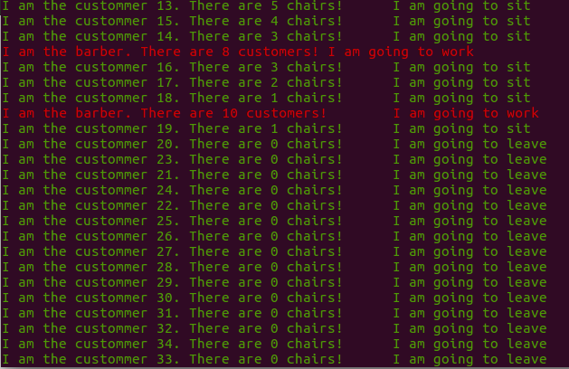
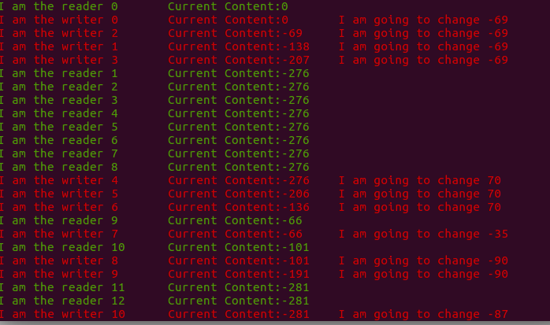
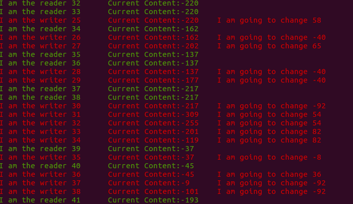

# 实验 2: 进程间通讯

## 2.1 实验目的

理解进程间通讯的基本原理。

## 2.2 实验要求

<1> 生产者消费者问题（信号量）

参考教材中的生产者消费者算法，创建5个进程，其中两个进程为生产者进程，3个进程为消费者进程。

一个生产者进程试图不断地在一个缓冲中写入大写字母，另一个生产者进程试图不断地在缓冲中写入小写字母。

3个消费者不断地从缓冲中读取一个字符并输出。为了使得程序的输出易于看到结果，仿照的实例程序，分别在生产者和消费者进程的合适的位置加入一些随机睡眠时间。

可选的实验：在上面实验的基础上实现部分消费者有选择地消费某些产品。例如一个消费者只消费小写字符，一个消费者只消费大写字母，而另一个消费者则无选择地消费任何产品。消费者要消费的产品没有时，消费者进程被阻塞。注意缓冲的管理。

<2> 用线程实现睡觉的理发师问题（同步互斥方式采用信号量或 mutex 方式均可）

理发师问题的描述：一个理发店接待室有 n 张椅子，工作室有 1 张椅子；没有顾客时，理发师睡觉；第一个顾客来到时，必须将理发师唤醒；顾客来时如果还有空座的话，他就坐在一个座位上等待；如果顾客来时没有空座位了，他就离开，不理发了；当理发师处理完所有顾客，而又没有新顾客来时，他又开始睡觉。

<3> 读者写者问题

教材中对读者写者问题算法均有描述，但这个算法在不断地有读者流的情况下，写者会被阻塞。编写一个写者优先解决读者写者问题的程序，其中读者和写者均是多个进程，用信号量作为同步互斥机制

## 2.3 实验步骤

<1> 编译链接生成可执行文件。

<2> 执行 `producer_consumer`，会创建 5 个进程，执行结果如下：

红字为生产者进程，绿字为消费者进程。

生产者进程有两个，用数字 `1` 和 `-1` 进行标示区分，其中 `1` 为大写字母生产者，`-1` 为小写字母生产者。

消费者进程有三个，用数字 `-1`、`0` 和 `1` 进行标示区分，其中 `-1` 为小写字母消费者，`0` 为大写字母消费者，`1` 为任意字母消费者。

<3> 执行 `barber`，会创建多个线程，执行结果如下：

红字为理发师线程，绿字为顾客线程。理发师线程有一个，顾客线程有多个。

图 1 中，一开始没有顾客，理发师线程处于睡眠状态。当有顾客到来时，理发师线程被唤醒，开始理发。新顾客到来时，发现有空座位，陆续坐下等待，直到坐满 10 个座位。理发师线程处理完当前顾客后，会检查是否还有顾客在等待，如果有则继续理发，如果没有则继续睡眠。

图 2 中，新顾客到来时，发现没有空座位，离开，对应线程直接结束。

<3> 执行 `reader_writer`，会创建多个进程，执行结果如下：

