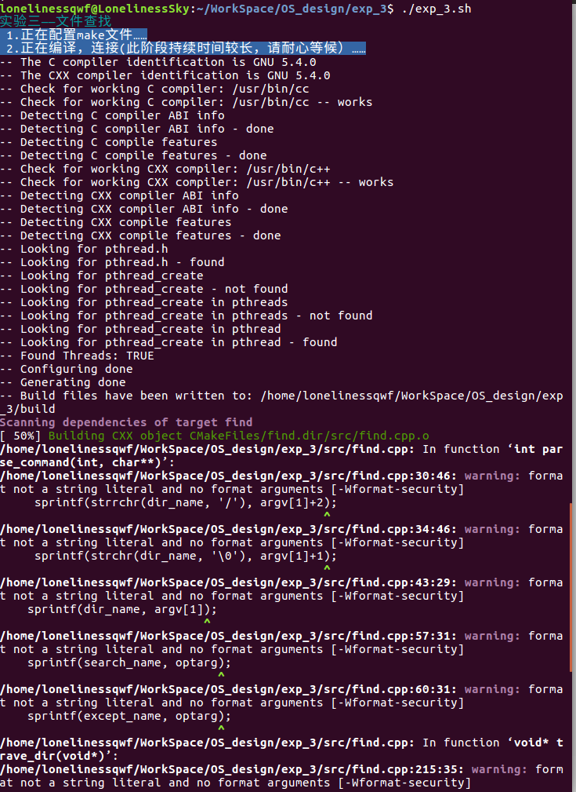
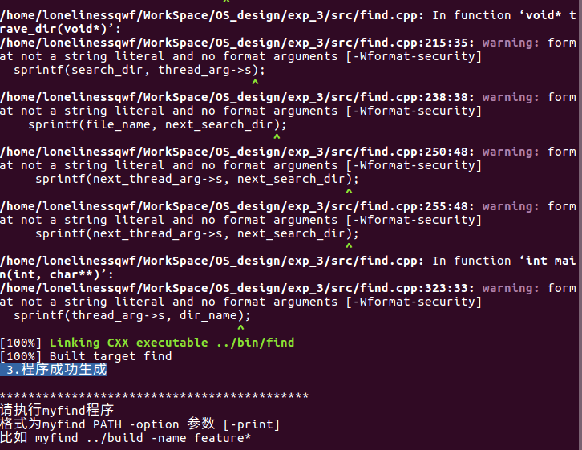
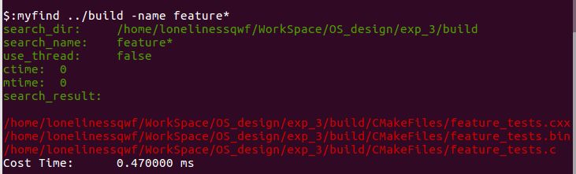
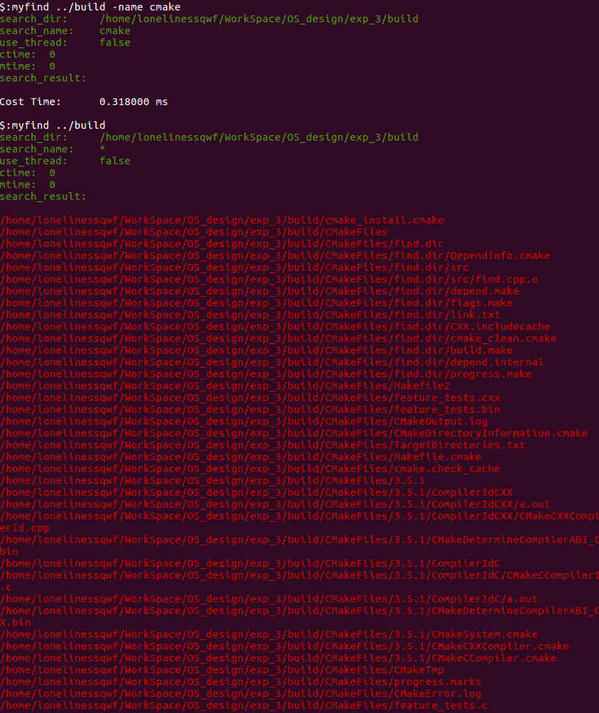
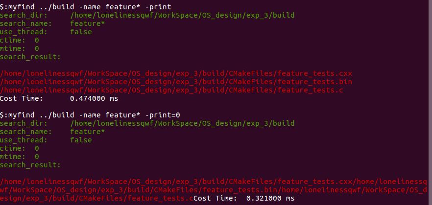
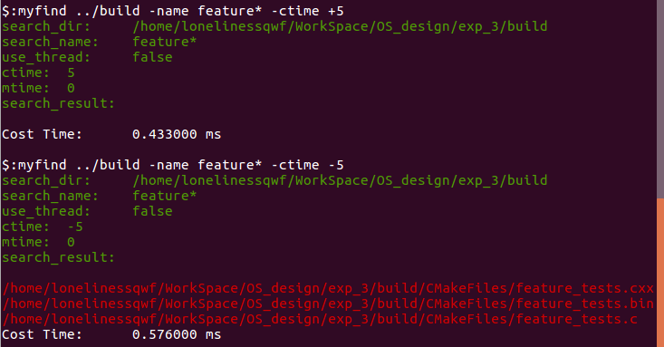
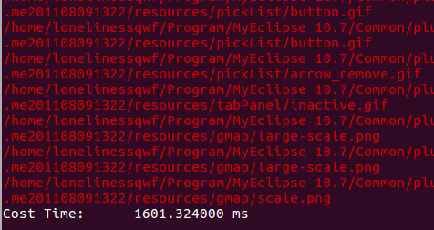
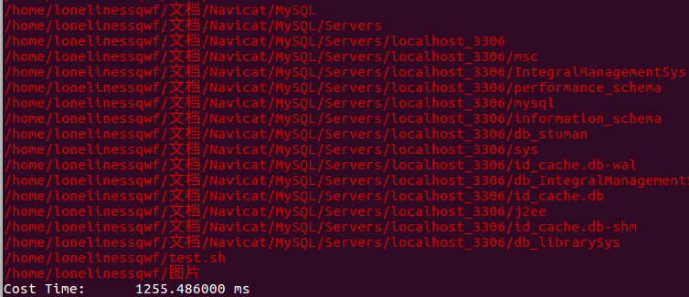
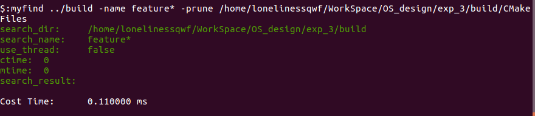

# 实验 3: 文件查找

## 3.1 实验目的

理解文件查找的基本原理。

## 3.2 实验要求

<1> 仿照 unix 操作系统中的 `find` 命令，实现一个 `myfind` 命令。`myfind` 命令从指定的目录下开始，递归地查找指定文件。其命令格式如下：

```shell
myfind PATH -option 参数 [-print] [-exec 命令 {} \;]
```

- `PATH`：查找的起始目录。
- `-option 参数`：用来控制搜索方式，具体如下（以下只给我常用的）：
  - `-name "文件"`：指定要查找的文件名，可以有通配符 `?` `*` 等。
  - `-prune 目录`：指出搜索时不搜索该目录。
  - `-mtime +n` 或 `-n`：按时间搜索，`+n`：表示 `n` 天之前修改过的文件；`-n`：表示今天到 `n` 天前之间修改过的文件。
  - `-ctime +n` 或 `-n`：也是按时间查找，`+n`：表示 `n` 天之前创建的文件；`-n`：表示今天到 `n` 天前之间创建的文件。
  - `-print`：将搜索结果输出到标准输出。

<2> 可选要求 1：实现 `-exe` 选项。

- `-exec`：对查找到的每一个结果实行指定的程序。格式如 `-exec 程序名`

<3> 可选要求 2：将你实现的 `myfind` 命令改为用多线程的方式实现。比较多线程实现的 `myfind` 与单线程实现的 `myfind` 的执行结果、效率等，并在实验报告中给出你的解释。

## 3.3 实验步骤

<1> 编译链接生成可执行文件。




<2> 标准测试，查找以 `feature` 开头的文件。



<3> 通配符测试



<4> 标准输出测试



<5> 时间条件测试



<6> 多线程测试

第一张图使用了多线程，第二张图没有使用。

可以看出，使用多线程反而增加了运行时间，初步猜想是因为频繁的线程切换消耗了大量时间




<7> 除外目录测试




## 3.4 实验总结

一开始用数组存储查找到的文件，结果查找大目录时数组溢出，尝试将数组长度扩大结果造成内存溢出系统崩溃，最后将查找到的文件名直接输出，解决了问题，所以以后解决问题时候要尽量从简。
