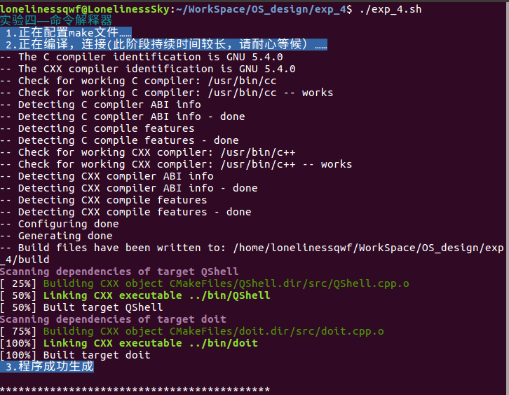
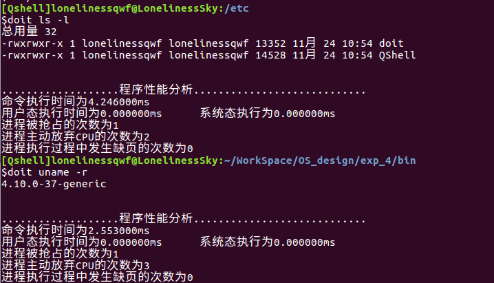
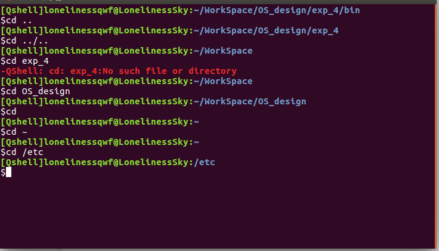
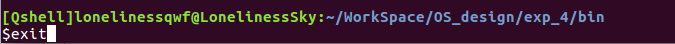
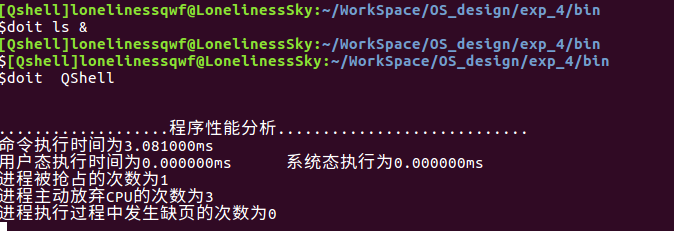

# 实验 4: 命令解释器

## 4.1 实验目的

- 熟悉 Linux 系统下的命令解释器的工作原理。
- 掌握命令解释器的基本功能和使用方法。
- 掌握命令解释器的编写方法。

## 4.2 实验内容

<1> 在 Linux 系统中实现一个命令执行程序 `doit`，它执行命令行参数中的命令，之后统计：

- 命令执行占用的 CPU 时间（包括用户态和系统态时间，以毫秒为单位）。
- 命令执行的时间。
- 进程被抢占的次数。
- 进程主动放弃 CPU 的次数。
- 进程执行过程中发生缺页的次数。

<2> 在 Linux 系统中实现一个简单的命令解释程序，功能要求：

- 同时支持内部命令和外部命令，内部命令支持两个（`cd`、`exit`）。
- 支持后台命令。

## 4.3 实验步骤

<1> shell 的基本框架可以用下面的代码概括：

```c
#define TRUE 1

while (TRUE) {
    type_prompt(); // display prompt on the screen
    read_command(command, parameters); // read input from terminal
    if (fork() != 0) {
        // parent
        waitpid(-1, &status, 0); // wait for child process to end
    } else {
        // child
        execve(command, parameters, 0); // execute command
    }
}
```

其中，`type_prompt()` 的实现流程如下：

1. 用户名通过 `getpwuid(getuid())` 获取，同时可以获取用户的主目录路径。
2. 主机名通过 `gethostname()` 获取。
3. 路径通过 `getcwd()` 获取，如果路径包含用户主目录路径，使用 `~` 缩略。
4. 提示符模仿 `bash` 风格，普通用户使用 `$`，`root` 用户使用 `#`，需要检测当前执行命令的用户权限，使用 `geteuid()` 是否为 `0` 判断。
5. 内建命令 `cd` 使用 `chdir()` 实现。
6. 外部命令：记录外部命令的地址，然后字符串匹配调用 `system()` 函数。
7. 后台运行：让父进程不等待子进程退出而直接读入用户的下一步操作即可，不执行 `wait()`。为了进一步模拟 `shell`，可以把子进程 ID 显示出来。

<2> 编译链接生成可执行文件。



<3> doit 测试。



<4> shell 测试。

首先测试内建命令 `cd`。



以及内建命令 `exit`。



测试外部命令 `doit`。


测试后台命令。


